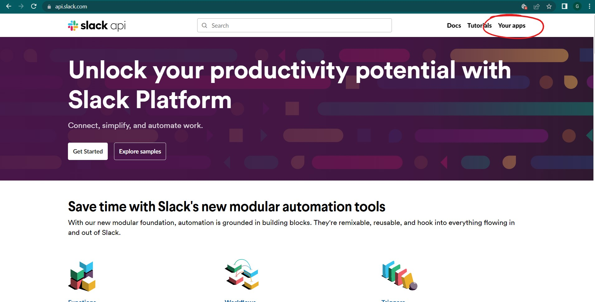
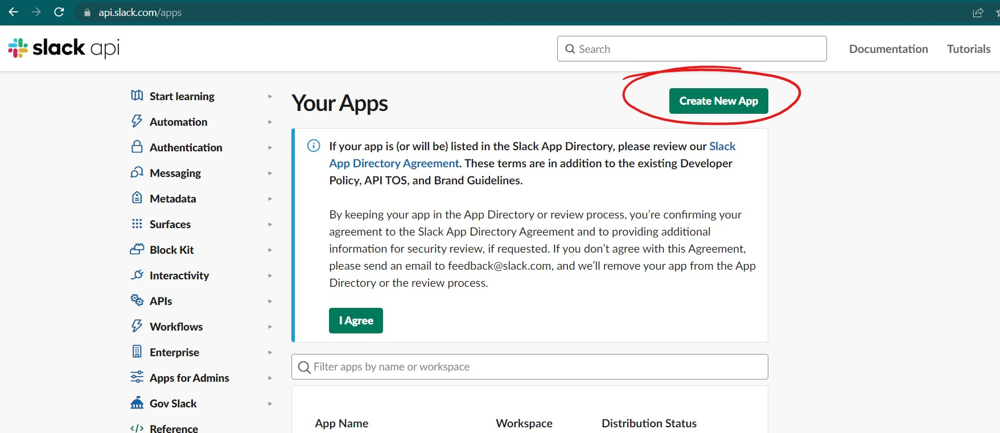
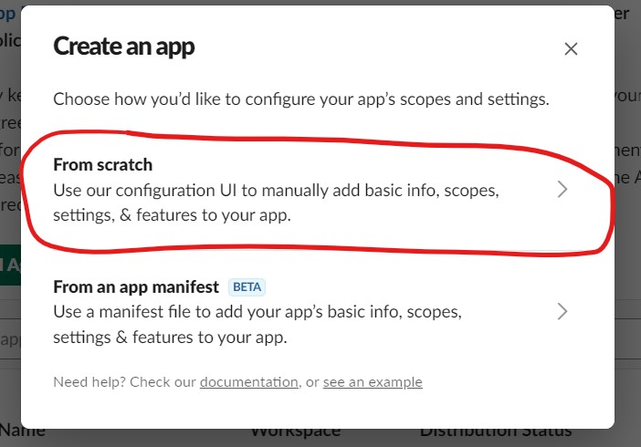
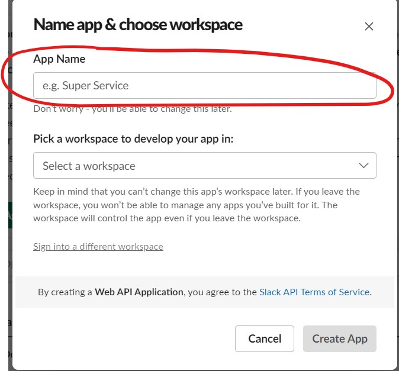
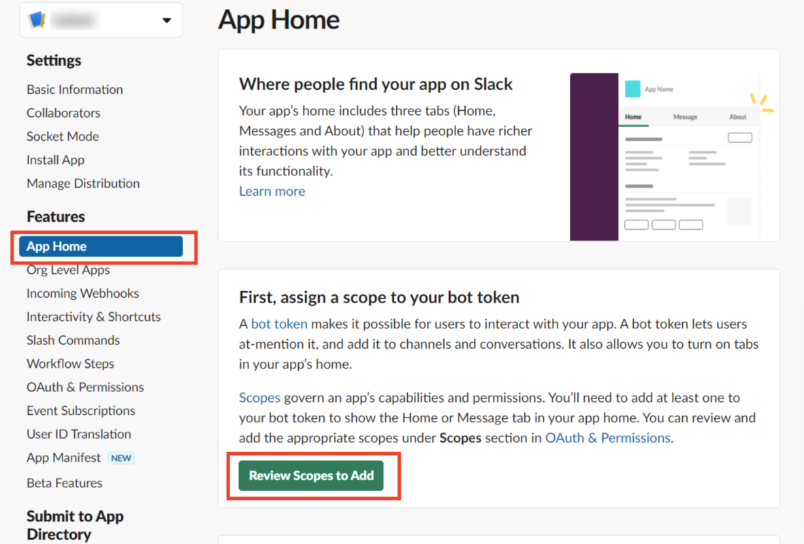
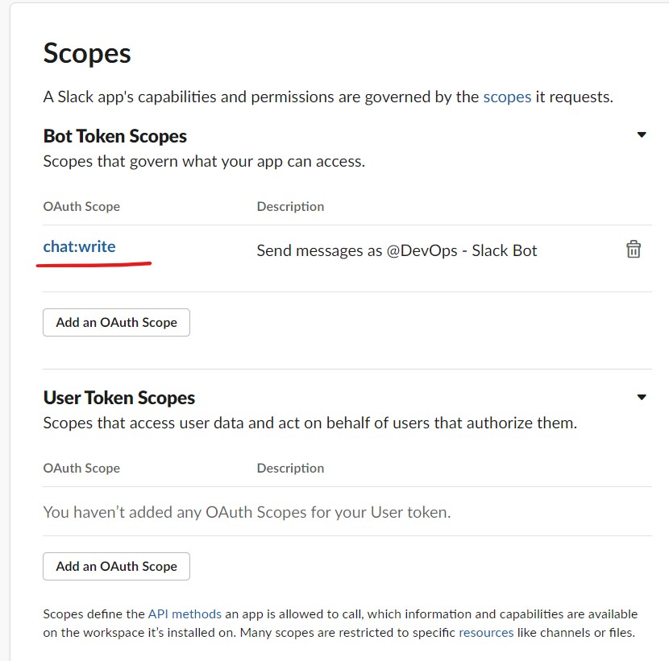
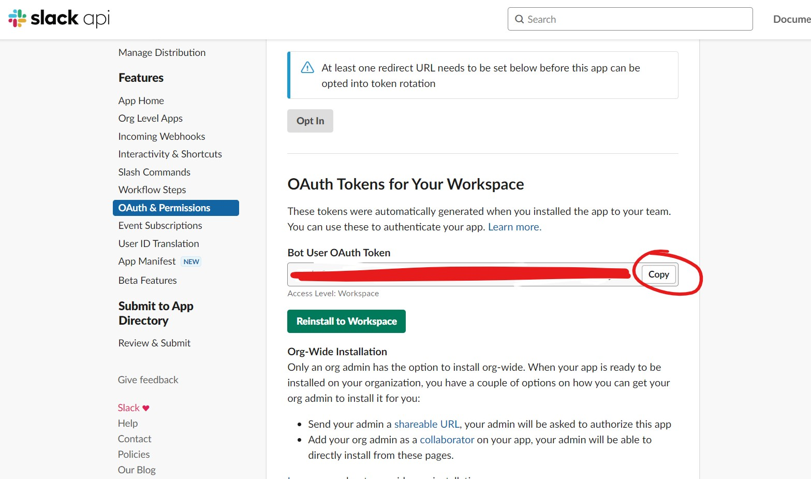
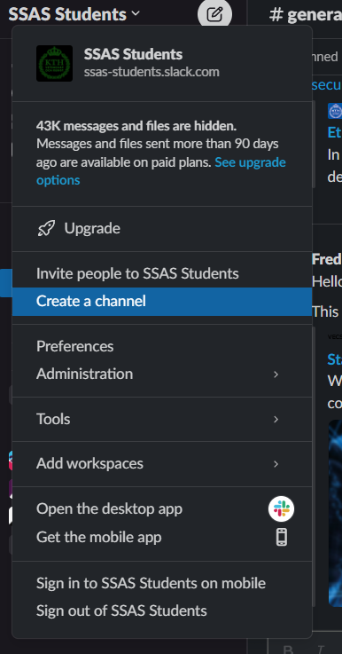
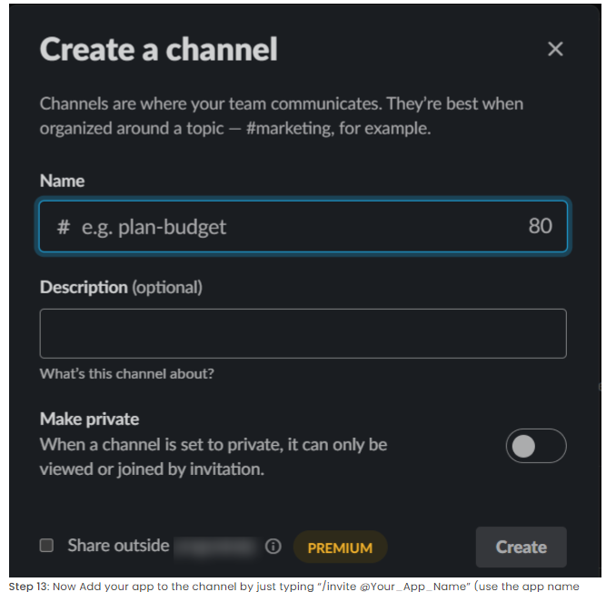

This is the first step of the tutorial. we can have a check going on to see if certain conditions are met.

## Step 1: Open slack API console. (https://api.slack.com/).

## Step 2: Click on “Your apps”.

## Step 3: Click on “Create New App”.

## Step 4: Click on “From scratch”.

## Step 5: Now give your app name and select workspace then click on the “Create App” button.

## Step 6: Click on the “App Home” button and click on “Review Scopes to Add”.

## Step 7:  After clicking on the “Review Scope to Add” button, scroll down and find the Scope section. Then click on the “Add an OAuth Scopes” Button under “Bot Token Scopes” and add “chat: write” as shown in the below image.

## Step 8: Now click on “Install to Workspace” and press on “Allow” to generate an OAuth token.

## Step 9: Now copy the above “OAuth Token” and paste it into a bonjour.py file as 
   ```SLACK_TOKEN="<Your Token>”. ```

## Step 10: Now we create the channel in slack and add our app to it. To open your slack account go to the channel bar and click on the “+” sign. Then click on “Create a new channel”.

## Step 11: Now type your channel name and click on the “Create” Button.


## Step 12: Now Add your app to the channel by just typing “/invite @Your_App_Name” (use the app name that you want to connect with the channel) in channel chat.
